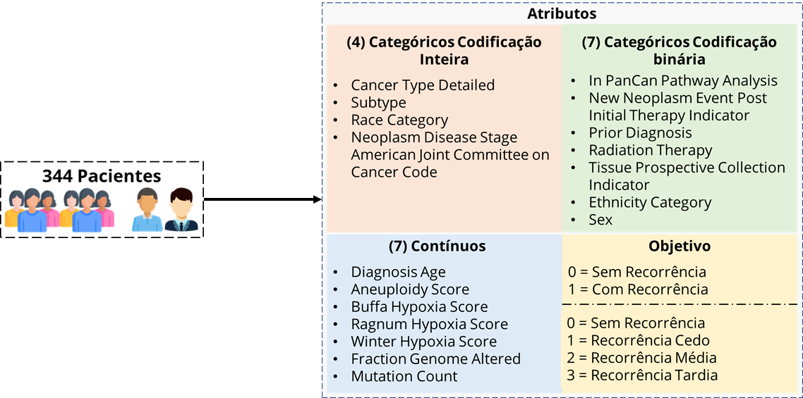

# Machine Learning Techniques Applied to the Classification of Breast Cancer Recurrence

## Table of Contents

- [Abstract](#abstract)
- [Methodology](#methodology)
- [Dataset Description](#dataset-description)
- [Results](#results)
- [File Description](#file-description)
- [References](#references)

## Abstract

Breast cancer affected 2.3 million women in 2020, resulting in 685,000 deaths worldwide. Death from breast cancer is mainly associated with metastasis and relapse. This work aims to analyze data corresponding to patients diagnosed with breast cancer, apply data mining to predict disease recurrence, and compare the performance of machine learning techniques in breast cancer relapse classification.

---

## Methodology

This project proposes three configurations using different data preprocessing techniques to analyze and compare the performance of Machine Learning (ML) models applied to recurrence classification in breast cancer.
Next Figure describes the methodological process employed for the development of the project. First, there is a General Pre-Processing block (GPP) of the data applied to the dataset. Then, configurations MC-1, MC-2, MC-3, and MC-4 defined for the evaluation of the models follow a line in which different operations are performed on the data before the training models.

---

## Dataset Description

In this study, two versions of the same dataset were used; the difference is the number of target classes (2 and 4) each had. This dataset contains 344 instances with 19 attributes, distributed in four categorical with integer coding, eight categorical with binary coding, and seven continuous. The target variable is a recurrence, and for versions 1 and 2 of the dataset, it is divided into (no recurrence, with recurrence) and (no recurrence, early recurrence, medium recurrence, late recurrence). Figure 2 shows the name of each attribute and its distribution.

---

## Results

---

## File Description

| File       |Description   |
|----------------|-------------------------------|
|[Projeto_Cancer.ipynb](https://github.com/DiegoPaezA/Cancer-Classification/blob/main/Projeto_Cancer.ipynb)           |Breast Cancer Recurrence Classification + 2 Classes Gridsearch Tunning|
|[Projeto_Cancer_4C.ipynb](https://github.com/DiegoPaezA/Cancer-Classification/blob/main/Projeto_Cancer_4C.ipynb)  |Breast Cancer Recurrence Classification + 4 Classes Gridsearch Tunning|
---

## References

Detailed description of the project can be find on the on the Article: [Machine Learning Techniques Applied to the Classification of Breast Cancer Recurrence](https://is.gd/OOfN45)
